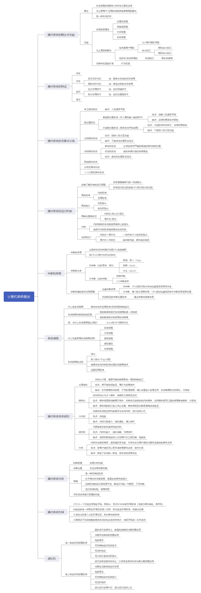

# 计算机系统概述

> 设计现代操作系统的主要目标是什么？

答：有效性、方便性、可扩充性、开放性。

> 操作系统的作用可表现在哪几个方面？

答： OS 作为用户与计算机硬件系统之间的接口， OS 作为计算机系统资源的管理者， OS 实现了对计算机资源的抽象。

> 为什么说操作系统实现了对计算机资源的抽象？

答： OS 首先在裸机上覆盖一层 I/O 设备管理软件，实现了对计算机硬件操作的第一层次抽象。

在第一层软件上再覆盖文件管理软件，实现了对硬件资源操作的第二层次抽象。 

OS 通过在计算机硬件上安装多层系统软件，增强了系统功能，隐藏了对硬件操作的细节，由它们共同实现了对计算机资源的抽象。

> 试说明推动多道批处理系统形成和发展的主要动力是什么。

答：主要动力来源于四个方面的社会需求与技术发展：不断提高计算机资源的利用率、方便用户、器件的不断更新换代、计算机体系结构的不断发展。

> 何谓脱机 I/O 和联机 I/O ？

答：脱机 I/O 是指事先将装有用户程序和数据的纸带或卡片装入纸带输入机或卡片机，在外围机的控制下，把纸带或卡片上的数据或程序输入到磁带上，该方式下的输入输出由外围机控制完成，是在脱离主机的情况下进行的。

联机 I/O 方式是指程序和数据的输入输出都是在主机的直接控制下进行的。

> 试说明推动分时系统形成和发展的主要动力是什么？

答：推动分时系统形成和发展的主要动力是更好地满足用户的需要，主要表现在： CPU 的分时使用缩短了作业的平均周转时间、人机交互能力使用户能直接控制自己的作业、主机的共享使多用户能同时使用同一台计算机，独立地处理自己的作业。

> 实现分时系统的关键问题是什么？应如何解决？

答：关键问题是当用户在自己的终端上键入命令时，系统应能及时接收并及时处理该命令，并在用户能接受的时延内将结果返回给用户。

解决方法：针对及时接收问题，可以在系统中设置多路卡，使主机能同时接收用户从各个终端上输入的数据，并为每个终端配置缓冲区，暂存用户键入的命令或数据。针对及时处理问题，应使所有的用户作业都直接进入内存，并且为每个作业分配一个时间片，允许作业只在自己的时间片内运行，这样在不长的时间内，能使每个作业都运行一次。

> 为什么要引入实时操作系统？

答：实时操作系统是指系统能及时响应外部事件的请求，在规定的时间内完成对该事件的处理，并控制所有实时任务协调一致地运行。引入实时 OS 是为了满足应用的需求，更好地满足实时控制领域和实时信息处理领域的需要。

> 什么是硬实时任务和软实时任务？试举例说明。

答：硬实时任务是指系统必须满足任务对截止时间的要求，否则可能出现难以预测的结果，举例来说，运载火箭的控制等。

软实时任务是指它的截止时间并不严格，偶尔错过了任务的截止时间，对系统产生的影响不大，举例来说，网页内容的更新、火车售票系统等。

> 试从交互性、及时性以及可靠性方面将分时系统与实时系统进行比较。

答：（1）及时性：实时信息处理系统对实时性的要求与分时系统类似，都是以人所能接受的等待时间来确定，而实时控制系统的及时性，是以控制对象所要求的开始截止时间或完成截止时间来确定的，一般为秒级到毫秒级，甚至有的要低于 100 微秒。

（2）交互性：实时信息处理系统具有交互性，但人与系统的交互仅限于访问系统中某些特定的专用服务程序，不像分时系统那样能向终端用户提供数据和资源共享等服务。

（3）可靠性：分时系统也要求系统可靠，但相比之下，实时系统则要求系统具有高度的可靠性，因为任何差错都可能带来巨大的经济损失，甚至是灾难性后果，所以在实时系统中，往往都采取了多级容错措施保障系统的安全性及数据的安全性。

> 操作系统有哪几大特征？其最基本的特征是什么？

答：并发性、共享性、虚拟性和异步性四个基本特征，最基本的特征是并发性。

> 在多道程序技术的操作系统环境下的资源共享与一般情况下的资源共享有何不同？对独占资源应采取何种共享方式？

答：一般情况下的共享与操作系统环境下的共享其含义并不完全相同，前者只是说明某种资源能被大家使用，如图书馆中的图书能提供给大家借阅，但并未限定借阅者必须在同一时间（间隔）和同一地点阅读，又如，学校中的计算机机房供全校学生上机，或者说，全校学生共享该机房中的计算机设备，虽然所有班级的上机地点是相同的，但各班的上机时间并不相同，对于这样的资源共享方式，只要通过适当的安排，用户之间并不会产生对资源的竞争，因此资源管理是比较简单的。

而在 OS 环境下的资源共享或称为资源复用，是指系统中的资源可供内存中多个并发执行的进程共同使用，这里在宏观上既限定了时间（进程在内存期间），也限定了地点（内存），对于这种资源共享方式，其管理就要复杂得多，因为系统中的资源少于多道程序需求的总和，会形成它们对共享资源的争夺，所以，系统必须对资源共享进行妥善管理。对独占资源应采用互斥共享方式。

> 什么是时分复用技术？举例说明它能提高资源利用率的根本原因是什么。

答：将资源在不同的时间片内分配给各进程以使该资源被重复利用，从而提高资源的利用率，如采用时分复用技术的虚拟处理机，能够在不同的时间片内处理多个用户的请求，从而使得用户感觉自已独占主机，而处理机在这期间也被充分的利用。

> 是什么原因使操作系统具有异步性特征？

答：操作系统的异步性体现在三个方面：一是进程的异步性，进程以人们不可预知的速度向前推进。二是程序的不可再现性，即程序执行的结果有时是不确定的。三是程序执行时间的不可预知性，即每个程序何时执行、执行顺序以及完成时间是不确定的。

> 处理机管理有哪些主要功能？其主要任务是什么？

答：处理机管理的主要功能是：进程管理、进程同步、进程通信和处理机调度。

进程管理：为作业创建进程，撤销已结束进程，控制进程在运行过程中的状态转换。

进程同步：为多个进程（含线程）的运行进行协调。

进程通信：用来实现在相互合作的进程之间的信息交换。

处理机调度：（1）作业调度。从后备队列里按照一定的算法，选出若干个作业，为他们分配运行所需的资源（首选是分配内存）。（2）进程调度：从进程的就绪队列中，按照一定算法选出一个进程，把处理机分配给它，并设置运行现场，使进程投入执行。

> 内存管理有哪些主要功能？其主要任务是什么？

答：内存管理的主要功能有：内存分配、内存保护、地址映射和内存扩充。

内存分配：为每道程序分配内存。

内存保护：确保每道用户程序都只在自己的内存空间运行，彼此互不干扰。

地址映射：将地址空间的逻辑地址转换为内存空间对应的物理地址。

内存扩充：用于实现请求调用功能，置换功能等。

> 设备管理有哪些主要功能？其主要任务是什么？

答：主要功能有：缓冲管理、设备分配和设备处理以及虚拟设备等。

主要任务：完成用户提出的 I/O 请求，为用户分配 I/O 设备，提高 CPU 和 I/O 设备的利用率，提高 I/O 速度以及方便用户使用 I/O 设备。

> 文件管理有哪些主要功能？其主要任务是什么？

答：文件管理主要功能：文件存储空间的管理、目录管理、文件的读/写管理和保护。

文件管理的主要任务：管理用户文件和系统文件，方便用户使用，保证文件安全性。

> 试说明推动传统操作系统演变为现代操作系统的主要因素是什么？

答：系统安全、网络的功能和服务、支持多媒体。

> 什么是微内核操作系统？

答：足够小的内核、基于客户/服务器模式、应用机制与策略分离原理、采用面向对象技术。

> 微内核操作系统具有哪些优点？它为何能有这些优点？

答：提高了系统的可扩展性，增强了系统的可靠性，可移植性，提供了对分布式系统的支持，融入了面向对象技术。

> 现代操作系统较之传统操作系统又增加了哪些功能和特征？

答：进程（线程）管理，低级存储器管理，中断和陷入处理。

> 在微内核操作系统中，为什么要采用客户/服务器模式？

答： C/S 模式具有独特的优点：数据的分布处理和存储，便于集中管理，灵活性和可扩充性，易于改编应用软件。

> 在基于微内核结构的操作系统中，应用了哪些新技术？

答：在基于微内核结构的 OS 中，采用面向对象的程序设计技术。

> 何谓微内核技术？在微内核中通常提供了哪些功能？

答：把操作系统中更多的成分和功能放到更高的层次（即用户模式）中去运行，而留下一个尽量小的内核，用它来完成操作系统最基本的核心功能，称这种技术为微内核技术。在微内核中通常提供了进程（线程）管理、低级存储器管理、中断和陷入处理等功能。

