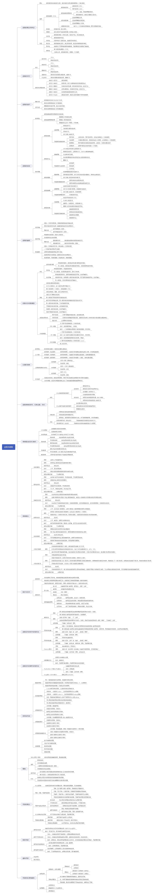

# 进程与线程

> 为什么程序并发执行会产生间断性特征？

答：程序在并发执行时，由于它们共享系统资源，为完成同一项任务需要相互合作，致使这些并发执行的进程之间，形成了相互制约关系，从而使得进程在执行期间出现间断性。

> 程序并发执行时为什么会失去封闭性和可再现性？

答：程序并发执行时，多个程序共享系统中的各种资源，因而这些资源的状态由多个程序改变，致使程序运行失去了封闭性，也会导致其失去可再现性。

> 在操作系统中为什么要引入进程的概念？它会产生什么样的影响？

答：为了使程序在多道程序环境下能并发执行，并对并发执行的程序加以控制和描述，在操作系统中引入了进程概念。影响：使程序的并发执行得以实行。

> 试从动态性、并发性和独立性上比较进程和程序。

答：动态性是进程最基本的特性，表现为由创建而产生，由调度而执行，因得不到资源而暂停执行，由撤销而消亡，进程有一定的生命期，而程序只是一
组有序的指令集合，是静态实体。

并发性是进程的重要特征，同时也是 OS 的重要特征，引入进程的目的正是为了使其程序能和其它进程的程序并发执行，而程序是不能并发执行的。

独立性是指进程实体是一个能独立运行的基本单位，也是系统中独立获得资源和独立调度的基本单位，对于未建立任何进程的程序，不能作为独立单位参加运行。

> 试说明 PCB 的作用具体表现在哪几个方面？为什么说 PCB 是进程存在的唯一标志？

答： PCB 是进程实体的一部分，是操作系统中最重要的记录型数据结构，作用是使一个在多道程序环境下不能独立运行的程序，成为一个能独立运行的基本单位，成为能与其它进程并发执行的进程， OS 是根据 PCB 对并发执行的进程进行控制和管理的。

> PCB 提供了进程管理和进程调度所需要的哪些信息？

答：进程管理：通用寄存器、指令计数器、程序状态字、用户栈指针。

进程调度：进程状态、进程优先级、事件、其他信息。

> 进程控制块的组织方式有哪几种？

答：线性方式、链接方式、索引方式。

> 何谓操作系统内核？内核的主要功能是什么？

答：现代操作系统一般将 OS 划分为若干层次，再将 OS 的不同功能分别设置在不同的层次中，通常将一些与硬件紧密相关的模块（如中断处理程序等）、各种常用设备的驱动程序以及运行频率较高的模块（如时钟管理、进程调度和许多模块所公用的一些基本操作），都安排在紧靠硬件的软件层次中，将它们常驻内存，即通常被称为的 OS 内核。

主要功能：中断处理、时钟管理、原语操作。

资源管理功能：进程管理、存储器管理、设备管理。

> 试说明进程在三个基本状态之间转换的典型原因。

答：（1）就绪状态→执行状态：进程分配到 CPU 资源。

（2）执行状态→就绪状态：时间片用完。

（3）执行状态→阻塞状态： I/O 请求。

（4）阻塞状态→就绪状态： I/O 完成。

> 为什么要引入挂起状态？该状态有哪些性质？

答：引入挂起状态处于五种不同的需要：终端用户需要、父进程需要、操作系统需要、对换需要和负荷调节需要。

处于挂起状态的进程不能接收处理机调度。

> 在进行进程切换时，所要保存的处理机状态信息有哪些？

答：（1）进程当前暂存信息。

（2）下一指令地址信息。

（3）进程状态信息。

（4）过程和系统调用参数及调用地址信息。

> 试说明引起进程创建的主要事件。

答：引起进程创建的主要事件有：用户登录、作业调度、提供服务、应用请求。

> 试说明引起进程被撤销的主要事件。

答：引起进程被撤销的主要事件有：正常结束、异常结束（越界错误、保护错、非法指令、特权指令错、运行超时、等待超时、算术运算错、 I/O 故障）、外界干预（操作员或操作系统干预、父进程请求、父进程终止）。

> 在创建一个进程时所要完成的主要工作是什么？

答：（1） OS 发现请求创建新进程事件后，调用进程创建原语 Creat() 。

（2）申请空白 PCB 。

（3）为新进程分配资源。

（4）初始化进程控制块。

（5）将新进程插入就绪队列。

> 在撤销一个进程时所要完成的主要工作是什么？

答：（1）根据被终止进程标识符，从 PCB 集中检索出进程 PCB，读出该进程状态。

（2）若被终止进程处于执行状态，立即终止该进程的执行，置调度标志真，指示该进程被终止后重新调度。

（3）若该进程还有子进程，应将所有子孙进程终止，以防它们成为不可控进程。

（4）将被终止进程拥有的全部资源，归还给父进程，或归还给系统。

（5）将被终止进程 PCB 从所在队列或列表中移出，等待其它程序搜集信息。

> 试说明引起进程阻塞或被唤醒的主要事件是什么？

答：（1）请求系统服务。

（2）启动某种操作。

（3）新数据尚未到达。

（4）无新工作可做。

> 为什么要在操作系统中引入线程？

答：在操作系统中引入线程，则是为了减少程序在并发执行时所付出的时空开销，使 OS 具有更好的并发性，提高 CPU 的利用率。

进程是分配资源的基本单位，而线程则是系统调度的基本单位。

> 试说明线程具有哪些属性？

答：（1）轻型实体。

（2）独立调度和分派的基本单位。

（3）可并发执行。

（4）共享进程资源。

> 试从调度性、并发性、拥有资源及系统开销方面对进程和线程进行比较。

答：（1）调度性：线程在 OS 中作为调度和分派的基本单位，进程只作为资源拥有的基本单位。

（2）并发性：进程可以并发执行，一个进程的多个线程也可并发执行。

（3）拥有资源：进程始终是拥有资源的基本单位，线程只拥有运行时必不可少的资源，本身基本不拥有系统资源，但可以访问隶属进程的资源。

（4）系统开销：操作系统在创建、撤消和切换进程时付出的开销显著大于线程。

> 何谓用户级线程和内核支持线程？

答：用户级线程：仅存在于用户空间中的线程，无须内核支持，这种线程的创建、撤销、线程间的同步与通信等功能，都无需利用系统调用实现，用户级线程的切换通常发生在一个应用进程的诸多线程之间，同样无需内核支持。

内核支持线程：在内核支持下运行的线程，无论是用户进程中的线程还是系统线程中的线程，其创建、撤销和切换等都是依靠内核，在内核空间中实现的，在内核空间里还为每个内核支持线程设置了线程控制块，内核根据该控制块感知某线程的存在并实施控制。

> 试说明内核支持线程的实现方法。

答：系统在创建新进程时，分配一个任务数据区 PTDA ，其中包括若干个线程控制块 TCB 空间。创建一个线程分配一个 TCB ，有关信息写入 TCB ，为之分配必要的资源。当 PTDA 中的 TCB 用完，而进程又有新线程时，只要所创建的线程数目未超过系统允许值，系统可再为之分配新的 TCB 。在撤销一个线程时，也应回收线程的所有资源和 TCB 。

> 多线程模型有哪几种类型？多对一模型有何优缺点？

答：多对一模型、一对一模型和多对多模型。

多对一模型的主要缺点在于如果一个线程在访问内核时发生阻塞，则整个进程都会被阻塞，此外，在任一时刻，只有一个线程能够访问内核，多个线程不能同时在多个处理机上运行。

> 高级调度与低级调度的主要任务是什么？为什么要引入中级调度？

答：高级调度的主要任务是根据某种算法，把外存上处于后备队列中的那些作业调入内存。

低级调度是保存处理机的现场信息，按某种算法选取进程，再把处理器分配给进程。

引入中级调度的主要目的是为了提高内存利用率和系统吞吐量，使那些暂时不能运行的进程不再占用内存资源，将它们调至外存等待，把进程状态改为就绪驻外存状态或挂起状态。

> 处理机调度算法的共同目标是什么？批处理系统的调度目标又是什么？

答：共同目标：资源利用率、公平性、平衡性、策略强制执行。

批处理系统的调度目标：平均周转时间短、系统吞吐量高、处理机利用率高。

> 何谓作业、作业步和作业流？

答：作业包含通常的程序和数据，还配有作业说明书，系统根据该说明书对程序的运行进行控制，批处理系统中是以作业为基本单位从外存调入内存。

作业步是指每个作业运行期间都必须经过若干个相对独立相互关联的顺序加工的步骤。

作业流是指若干个作业进入系统后依次存放在外存上形成的输入作业流，在操作系统的控制下，逐个作业进行处理，于是形成了处理作业流。

> 在什么情况下需要使用作业控制块 JCB ，其中包含了哪些内容？

答：每当作业进入系统时，系统便为每个作业建立一个作业控制块 JCB ，根据作业类型将它插入到相应的后备队列中。

JCB 包含的内容通常有：作业标识、用户名称、用户账户、作业类型（ CPU 繁忙型、 I/O 繁忙型、批量型、终端型）、作业状态、调度信息（优先级、作业已运行）、资源要求、进入系统时间、开始处理时间、作业完成时间、作业退出时间、资源使用情况等。

> 在作业调度中应如何确定接纳多少个作业和接纳哪些作业？

答：作业调度每次接纳进入内存的作业数，取决于多道程序。应将哪些作业从外存调入内存，取决于采用的调度算法。最简单的是先来服务调度算法，较常用的是短作业优先调度算法和基于作业优先级的调度算法。

> 试说明低级调度的主要功能。

答：（1）保存处理机的现场信息。

（2）按某种算法选取进程。

（3）把处理机分配给进程。

> 在抢占调度方式中，抢占的原则是什么？

答：时间片原则、优先权原则、短作业优先权原则等。

> 在选择调度方式和调度算法时，应遵循的准则是什么？

答：面向用户的准则：周转时间短、响应时间快、截止时间的保证、优先权准则。

面向系统的准则：系统吞吐量高、处理机利用率好、各类资源的平衡利用。

> 在批处理系统、分时系统和实时系统中，各采取哪几种进程（作业）调度算法？

答：批处理系统的调度算法：短作业优先、优先权、高响应比优先、多级反馈队列调度算法。

分时系统的调度算法：时间片轮转法。

实时系统的调度算法：最早截止时间优先即 EDF 、最低松驰度优先即 LLF 算法。

> 何谓静态和动态优先级？确定静态优先级的依据是什么？

答：静态优先级是指在创建进程时确定且在进程的整个运行期间保持不变的优先级。

动态优先级是指在创建进程时赋予的优先权，可以随进程推进或随其等待时间增加而改变的优先级，可以获得更好的调度性能。

确定静态优先级的依据：进程类型、进程对资源的需求和用户要求。

> 试比较 FCFS 和 SJF 两种进程调度算法。

答：相同点：两种调度算法都可以用于作业调度和进程调度。

不同点： FCFS 调度算法每次都从后备队列中选择一个或多个最先进入该队列的作业，将它们调入内存、分配资源、创建进程、插入到就绪队列。该算法有利于长作业/进程，不利于短作业/进程。 SPF 算法每次调度都从后备队列中选择一个或若干个估计运行时间最短的作业，调入内存中运行，该算法有利于短作业/进程，不利于长作业/进程。

> 在时间片轮转法中，应如何确定时间片的大小？

答：时间片应略大于一次典型的交互需要的时间。一般应考虑三个因素：系统对相应时间的要求、就绪队列中进程的数目和系统的处理能力。

> 通过一个例子来说明通常的优先级调度算法为什么不能适用于实时系统？

答：实时系统的调度算法很多，主要是基于任务的开始截止时间和任务紧急/松驰程度的任务优先级调度算法，通常的优先级调度算法不能满足实时系统的调度实时性要求而不适用。

> 为什么说多级反馈队列调度算法能较好地满足各方面用户的需要？

答：终端型用户：由于终端型用户提交的作业多属于交互型作业，通常较小，系统只要能使这些作业在第一队列规定的时间片内完成，便可使终端型用户感到满
意。

短批处理作业用户：对于这类作业，如果可在第一队列中执行完成，便获得与终端型作业一样的响应时间。对于稍长的短作业，也只需在第二和第三队列各执行一时间片完成，其周转时间仍然较短。

长批处理作业用户：对于长作业，它将依次在第 1 , 2 ，… , n 个队列中运行然后再按轮转方式运行，用户不必担心其作业长期得不到处理。

> 为什么说传统的几种调度算法都不能算是公平调度算法？

答：以上介绍的几种调度算法所保证的只是优先运行，如优先级算法是优先级最高的作业优先运行，但并不保证作业占用了多少处理机时间，另外也未考虑到调度的公平性。

> 保证调度算法是如何做到调度的公平性的？

答：保证调度算法是另外一种类型的调度算法，它向用户所做出的保证并不是优先运行，而是明确的性能保证，该算法可以做到调度的公平性。一种比较容易实现的性能保证是处理机分配的公平性，如果在系统中有 n 个相同类型的进程同时运行，为公平起见，须保证每个进程都获得相同的处理机时间 1/n 。

> 公平分享调度算法又是如何做到调度的公平性的？

答：在公平分享调度算法中，调度的公平性主要是针对用户而言，使所有用户能获得相同的处理机时间，或所要求的时间比例。

> 为什么在实时系统中，要求系统（尤其是 CPU ）具有较强的处理能力？

答：在实时系统中，不但包括周期任务、偶发任务、非周期任务，还包括非实时任务，实时任务要求满足时限，而非实时任务要求要使其响应时间尽可能的短，多种类型任务的混合，使系统的可调度性分析更加困难。实际上有些实时系统 CPU 处理能力并不强，比如一些嵌入式实时系统，这就要求系统尽量少做一些并发计算任务，留出足够冗余处理实时任务。

> 按调度方式可将实时调度算法分为哪几种？

答：按调度方式不同，可分为非抢占调度算法和抢占调度算法两种。

> 什么是最早截止时间优先调度算法？举例说明之。

答：根据任务的开始截止时间确定的任务优先级调度算法，截止时间越早则优先级越高。该算法要求在系统中保持一个实时任务就绪队列，该队列按各任务截止时间的先后排序。

> 什么是最低松弛度优先调度算法？举例说明之。

答：该算法是根据任务的紧急（或松驰）程度，来确定任务的优先级，任务的紧急程度越高，为该任务所赋予的优先级就越高，以使之优先执行。例如，一个任务在 200ms 内必须完成，而它本身所需的运行时间就有 100ms ，因此，调度程序必须在 100ms 之前调度执行，该任务的紧急程度（松驰程度）为100ms 。又如，另一任务在 400ms 内必须完成，它本身需要运行 150ms ，则其松弛程度为 250ms 。

最早截止时间优先调度算法：任务要求的截止时间越早，其优先级就越高。

最低松驰度优先调度算法：任务的紧急程度越高，其优先级就越高。

> 何谓“优先级倒置”现象，可采取什么方式来解决？

答：当前 OS 广泛采用优先级调度算法和抢占方式，然而在系统中存在着影响进程运行的资源而可能产生“优先级倒置”的现象，即高优先级进程（或线程）被低优先级进程（或线程）延迟或阻塞。

> 试分别说明可重用资源和可消耗资源的性质。

答：可重用性资源：每一个可重用性资源中的单元只能分配给一个进程使用，不允许多个进程共享，进程在使用可重用性资源时，按照请求资源、使用资源、释放资源，系统中每一类可重用性资源中的单元数目是相对固定的，进程在运行期间既不能创建也不能删除它。

可消耗性资源：每一类可消耗性资源的单元数目在进程运行期间是可以不断变化的，有时它可以有许多，有时可能为 0 ，进程在运行过程中，可以不断创造可消耗性资源的单元，将它们放入该资源类的缓冲区中，以增加该资源类的单元数目，进程在运行过程中，可以请求若干个可消耗性资源单元，用于进程自己的消耗，不再将它们返回给该资源类中。

> 为了破坏“请求和保持”条件而提出了两种协议，试比较这两种协议。

答：第一种协议在所有进程开始运行之前，必须一次性地申请其在整个运行过程中所需的全部资源，并且在分配资源时，只要有一种资源不能满足进程的要求，即使其它所需的各种资源都空闲也不分配给该进程，而让该进程等待，因此有资源被严重浪费、进程经常会发生饥饿现象等缺点。

第二种协议是对第一种协议的改进，它允许一个进程只获得运行初期所需的资源后，便开始运行，进程运行过程中再逐步释放已分配给自己的、且已用毕的全部资源，然后再请求新的所需资源，如此便可提高设备的利用率，还可减少进程发生饥饿的概率。

> 何谓死锁？产生死锁的原因和必要条件是什么？

答：（1）死锁是指多个进程因竞争资源而造成的一种僵局，若无外力作用，这些进程都将永远不能再向前推进。

（2）产生死锁的原因有二，一是竞争资源，二是进程推进顺序非法。

（3）必要条件是：互斥条件、请求和保持条件、不可剥夺条件和循环等待条件。

> 在解决死锁问题的几个方法中，哪种方法最易于实现？哪种方法使资源利用率最高？

答：解决/处理死锁的方法有预防死锁、避免死锁、检测和解除死锁。

其中预防死锁方法最容易实现，但由于所施加的限制条件过于严格，会导致系统资源利用率和系统吞吐量降低。

而检测和解除死锁方法可使系统获得较好的资源利用率和系统吞吐量。

> 请详细说明可通过哪些途径预防死锁。

答：（1）摒弃“请求和保持”条件：系统规定所有进程开始运行之前，都必须一次性地申请其在整个运行过程所需的全部资源，但在分配资源时，只要有一种资源不能满足某进程的要求，即使其它所需的各资源都空闲，也不分配给该进程，而让该进程等待。

（2）摒弃“不可剥夺”条件：系统规定，进程是逐个地提出对资源的要求的，当一个已经保持了某些资源的进程，再提出新的资源请求而不能立即得到满足时，必须释放它已经保持了的所有资源，待以后需要时再重新申请。

（3）摒弃“环路等待”条件：系统将所有资源按类型进行线性排序，并赋子不同的序号，且所有进程对资源的请求必须严格按序号递增的次序提出，这样，在所形成的资源分配图中，不可能再出现环路，因而摒弃了“环路等待”条件。

