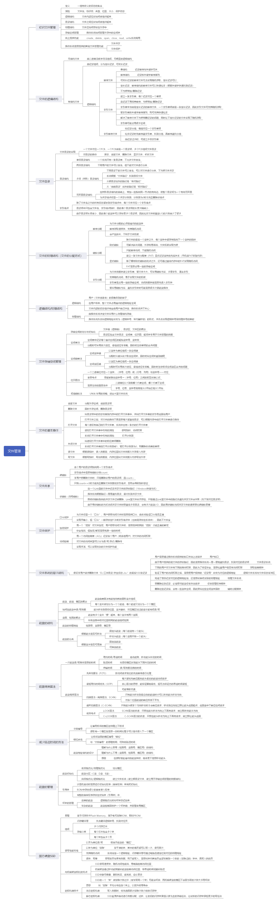

# 文件管理

> 何谓数据项、记录和文件？

答：数据项是最低级的数据组织形式，可分为基本数据项和组合数据项。基本数据项是用于描述一个对象某种属性的字符集，是数据组织中可以命名的最小逻辑数据单位，即原子数据，又称为数据元素或字段，组合数据项则由若干个基本数据项构成。

记录是一组相关数据项的集合，用于描述一个对象某方面的属性。文件是指由创建者所定义的、具有文件名的一组相关信息的集合。

> 文件系统的模型可分为三层，试说明其每一层所包含的基本内容。

答：最低层为对象及其属性说明，主要包括物理文件相关功能，包括文件和目录、磁盘存储空间等对象。

中间层是对对象进行操纵和管理的软件集合，是文件系统的核心部分，主要是逻辑文件相关功能，包括文件存储空间管理、文件目录管理、逻辑文件到物理文件的映射、文件读写管理及文件共享与保护等诸多功能。

最高层是文件系统提供给用户的接口，分为命令接口、图形化用户接口和程序接口等三种类型。

> 何谓文件的逻辑结构？何谓文件的物理结构？

答：文件的逻辑结构是指从用户的观点出发所观察到的文件组织形式，也就是用户可以直接处理的数据及其结构，它独立于物理特性。

而文件的物理结构则是指文件在外存上的存储组织形式，与存储介质的存储性能有关。

> 如何提高对变长记录顺序文件的检索速度？

答：为了提高对变长记录顺序文件的检索速度，可为其建立一张索引表，以主文件中每条记录的长度及指向对应记录的指针（即该记录在逻辑地址空间的首址）作为相应每个表项的内容。由于索引表本身是一个定长记录的顺序文件，若将其按记录键排序，则可以实现对主文件的方便快速的直接存取，需要指出的是，如果文件较大，应通过建立分组多级索引以进一步提高检索效率。

> 试说明关于索引文件和索引顺序文件的检索方法。

答：对索引文件进行检索时，首先根据用户（程序）提供的关键字，并利用某种（折半查找）算法检索索引表，从中找到相应的表项，再利用该表项中给出的指向记录的指针值，去访问对应的记录。

对索引顺序文件结合了索引和顺序查找，适合于巨量数据的查找，它将数据分组建立索引（以减少索引表的长度），首先利用用户（程序）提供的关键字以及某种查找方法，去检索索引表，找到该记录所在记录组中的第一条记录的表项，然后在组内进行顺序查找，由于组内的数据量不多，所以组内顺序查找开销很小。

> 对目录管理的主要要求是什么？

答：实现“按名存取”、提高对目录的检索速度、文件共享、允许文件重名。

> 采用单级目录能否满足对目录管理的主要要求？为什么？

答：采用单级目录不能完全满足对目录管理的主要要求，只能实现目录管理最基本的功能，即按名存取。

由于单级目录结构采用的是在系统只配置一张目录表用来记录系统中所有文件的相关信息，因此此目录文件可能会非常大，在查找时速度慢，另外不允许用户文件有重名的现象，再者由于单级目录中要求所有用户须使用相同的名字来共享同一个文件，这样又会产生重名问题，因此不便于实现文件共享。

> 目前广泛采用的目录结构形式是哪种？它有什么优点？

答：目前广泛采用的目录结构是树型目录结构。它具有以下优点：

（1）能有效提高对目录的检索速度：假定文件系统中有 N 个文件，在单级目录中，最多要检索 N 个目录项，但对于有 i 级的树型目录，在目录中每检索一个指定文件，最多可能要检索 i * √N 个目录项。

（2）允许文件重名：由于在树型结构的文件系统中，是利用文件路径名来检索文件的，故允许每个用户在自己的分目录中使用与其他用户文件相同的名字。

（3）便于实现文件共享：在树型目录中，用户可通过路名来共享其他用户的文件，也可将一个共享文件链接到自己的目录下，从而使文件的共享变得更为方便，其实现方式也非常简单，系统只需在用户的目录文件中增设一个目录项，填上用户赋予该共享文件的新文件名，以及该共享文件的唯一标识符即可。

> Hash 检索法有何优点？又有何局限性？

答：在 Hash 检索法中，系统利用用户提供的文件名并将它变换为文件目录的索引值，再利用该索引值到目录中去查找，这样能有效地提高目录的检索速度，但 Hash 检索法也有局限性，即对于使用了通配符的文件名，系统是无法使用 Hash 检索法检索目录的。

