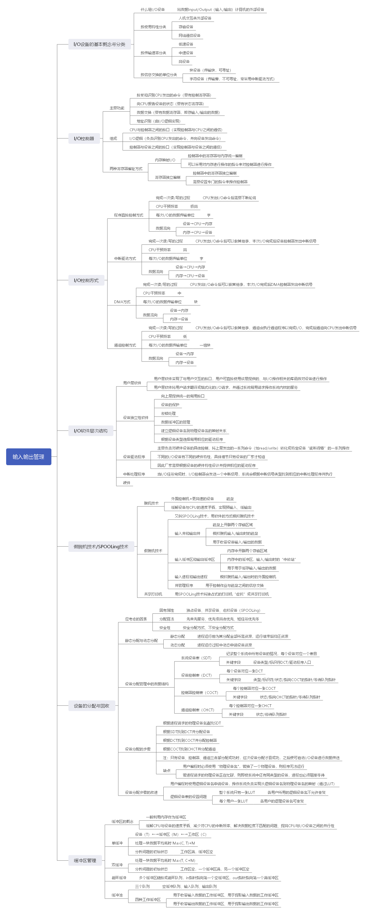

# 输入输出管理

> 试说明 I/O 系统的基本功能。

答：隐藏物理设备的细节、与设备的无关性、提高处理机和 I/O 设备的利用率、对 I/O 设备进行控制确保对设备的正确共享、错误处理。

> 简要说明 I/O 软件的四个层次的基本功能。

答：用户层 I/O 软件：用于实现用户与 I/O 设备交互。

设备独立性软件：用于实现用户程序与设备驱动器的统一接口、设备命令、设备保护，以及设备分配与释放等。

设备驱动程序：与硬件直接有关，用来具体实现系统对设备发出的操作指令，驱动 I/O 设备工作。

中断处理程序：用于保存被中断进程的 CPU 环境，转入相应的中断处理程序进行处理，处理完后恢复现场，并返回到被中断的进程。

> I/O 系统接口与软件/硬件（RW / HW）接口分别是什么接口？

答： I/O 系统接口是 I/O 系统与上层系统之间的接口，向上层提供对设备进行操作的抽象 I/O 命令，以方便高层对设备的使用。

软件/硬件（RW / HW）接口的上面是中断处理程序，用于不同设备的设备驱动程序，它的下面是各种设备的控制器。

> 与设备无关性的基本含义是什么？为什么要设置该层？

答：为了提高 OS 的可适应性和可扩展性，在现代 OS 中都毫无例外地实现了设备独立性，也称设备无关性。

基本含义：应用程序独立于具体使用的物理设备，为了实现设备独立性而引入了逻辑设备和物理设备两个概念，在应用程序中，使用逻辑设备名称来请求使用某类设备，而系统在实际执行时，还必须使用物理设备名称。

优点：设备分配时的灵活性、易于实现 I/O 重定向（用于 I/O 操作的设备可以更换，即重定向），而不必改变应用程序。

> 试说明设备控制器的组成。

答：设备控制器与处理机的接口、设备控制器与设备的接口、 I/O 逻辑。

> 为了实现 CPU 与设备控制器间的通信，设备控制器应具备哪些功能？

答：基本功能：接收和识别命令、数据交换、标识和报告设备的状态、地址识别、数据缓冲、差错控制。

> 为什么说中断是 OS 赖以生存的基础？

答：中断在操作系统中有着特殊重要的地位，它是多道程序得以实现的基础，没有中断，就不可能实现多道程序，因为进程之间的切换是通过中断来完成的。另一方面，中断也是设备管理的基础，为了提高处理机的利用率和实现 CPU 和 I/O 设备并行，也必需有中断的支持。

> 对多中断源的两种处理方式分别用于何种场合？

答：（1）屏蔽（禁止）中断：当处理机正在处理一个中断时，将屏蔽掉所有的中断，直到处理机已处理完本次中断，再去检查是否有中断产生，所有中断按顺序处理，优点是简单，但不能用于实时性要求较高的中断请求。

（2）嵌套中断：在设置了中断优先级的系统中，当同时有多个不同优先级的中断请求， CPU 优先响应优先级最高的中断请求，高优先级的中断请求可以抢占正在运行的低优先级中断的处理机。

> 设备中断处理程序通常需完成哪些工作？

答：（1）唤醒被阻塞的驱动进程。

（2）保护被中断进程的 CPU 环境。

（3）转入相应的设备处理程序。

（4）中断处理。

（5）恢复被中断进程的现场。

> 简要说明中断处理程序对中断进行处理的几个步骤。

答：（1）测定是否有未响应的中断信号。

（2）保护被中断进程的 CPU 环境。

（3）转入相应的设备处理程序。

（4）中断处理。

（5）恢复 CPU 的现场并退出中断。

> 设备驱动程序通常要完成哪些工作？

答：（1）将接收到的抽象要求转为具体要求。

（2）检查用户 I/O 请求合法性，了解 I/O 设备状态，传递有关参数，设置设备工作方式。

（3）发出 I/O 命令，启动分配到的 I/O 设备，完成指定 I/O 操作。

（4）及时响应由控制器或通道发来的中断请求，根据中断类型调用相应中断处理程序处理。

（5）对于有通道的计算机，驱动程序还应该根据用户 I/O 请求自动构成通道程序。

> 简要说明设备驱动程序的处理过程可分为哪几步。

答：（1）将抽象要求转换为具体要求。

（2）对服务请求进行校验。

（3）检查设备的状态。

（4）传送必要的参数。

> 试说明推动 I/O 控制发展的主要因素是什么。

答：促使 I/O 控制不断发展的几个主要因素如下：

（1）尽量减少CPU 对 I/O 控制的干预，把 CPU 从繁杂的 I/O 控制中解脱出来，以使更多地去完成数据处理任务。

（2）缓和 CPU 的高速性和设备的低速性之间速度不匹配的矛盾，以提高 CPU 的利用率和系统的吞吐量。

（3）提高 CPU 和 I/O 设备操作的并行程度，使 CPU 和 I/O 设备都处于忙状态，从而提高整个系统的资源利用率和系统吞吐量。

> 有哪几种 I/O 控制方式？各适用于何种场合？

答： I/O 控制方式：程序 I/O 方式、中断驱动 I/O 控制方式、 DMA I/O 控制方式、 I/O 通道控制方式。

程序 I/O 方式适用于早期的计算机系统中，并且是无中断的计算机系统。

中断驱动 I/O 控制方式是普遍用于现代的计算机系统中。

DMA I/O 控制方式适用于 I/O 设备为块设备时在和主机进行数据交换的一种 I/O 控制方式。

当 I/O 设备和主机进行数据交换是一组数据块时通常采用 I/O 通道控制方式，但此时要求系统必须配置相应的通道及通道控制器。

> 试说明 DMA 的工作流程。

答：当 CPU 要从碰盘读入数据块时，先向磁盘控制器发送一条读命令，该命令被送到命令寄存器 CR 中，同时还发送本次要读入数据的内存起始目标地址，送入内存地址寄存器 MAR ，本次要读数据的字节数送入数据计数器 DC ，将磁盘中的源地址直接送 DMA 控制器的 I/O 控制逻辑上，然后启动 DMA 控制器传送数据，以后 CPU 便处理其它任务，整个数据传送过程由 DMA 控制器控制。

> 为何要引入与设备的无关性？如何实现设备的独立性？

答：引入设备独立性，可使应用程序独立于具体的物理设备，使设备分配具有灵活性，另外容易实现 I/O 重定向。

为了实现设备独立性，必须在设备驱动程序之上设置一层设备独立性软件，用来执行所有 I/O 设备的公用操作，并向用户层软件提供统一接口。

关键是系统中必须设置一张逻辑设备表 LUT 用来进行逻辑设备到物理设备的映射，其中每个表目中包含了逻辑设备名、物理设备名和设备驱动程序入口地址三项，当应用程序用逻辑设备名请求分配 I/O 设备时，系统必须为它分配相应的物理设备，并在 LUT 中建立一个表目，以后进程利用该逻辑设备名请求 I/O 操作时，便可从 LUT 中得到物理设备名和驱动程序入口地址。

> 与设备的无关的软件中，包括了哪些公有操作的软件？

答：（1）设备驱动程序的统一接口。

（2）缓冲管理。

（3）差错控制。

（4）对独立设备的分配与回收。

（5）独立于设备的逻辑数据块。

> 在考虑到设备的独立性时，应如何分配独占设备？

答：（1）进程以逻辑设备名提出 I/O 请求。

（2）根据逻辑设备表相应表项获得 I/O 请求的逻辑设备对应类型的物理设备在系统设备表中的指针。

（3）从指针所指位置起顺序检索系统设备表，直到找到一个属于对应 I/O 请求所用类型、空闲可用且基于设备分配安全性算法验证为安全分配的设备的设备控制表，将对应设备分配给请求进程，如果未找到安全可用的空闲设备，则把请求进程的进程控制块挂到相应类型设备的等待队列上等待唤醒和分配。

（4）系统把设备分配给 I/O 请求进程后，再到该设备的设备控制表中找出与其相连接的控制器的控制器控制表，根据其状态字段判断该控制器是否忙碌，若忙则把请求进程的进程控制块挂到该控制器的等待队列上，否则将该控制器分配给进程。

（5）系统把控制器分配给 I/O 请求进程后，再到该控制器的控制器控制表中找出与其相连接的通道的通道控制表，根据其状态字段判断该通道是否忙碌，若忙则把请求进程的进程控制块挂到该通道的等待队列上，否则将该通道分配给进程。

（6）只有在设备、控制器和通道三者都分配成功时，这次的设备分配才算成功，然后便可启动设备进行数据传送。

> 何谓设备虚拟？实现设备虛拟时所依赖的关键技术是什么？

答：通过虚拟技术可将一台独占设备变换成若干台逻辑设备，供若干个用户（进程）同时使用，通常把这种经过虚拟技术处理后的设备称为虚拟设备，其实现所依赖的关键技术是 SPOOLing 技术。

> 在实现后台打印时， SPOOLing 系统应为请求 I/O 的进程提供哪些服务？

答：（1）由输出进程在输出井中为之申请一空闲盘块区，并将要打印的数据送入其中。

（2）输出进程再为用户进程申请一张空白的用户打印表，并将用户的打印要求填入其中，再将该表挂到请求打印队列上。

（3）一旦打印机空闲，输出进程便从请求打印队列的队首取出一张请求打印表，根据表中的要求将要打印的数据从输出井传送到内存缓冲区，再由打印机进行打印。

> 假脱机系统向用户提供共享打印机的基本思想是什么？

答：对每个用户而言，系统并非即时执行其程序输出数据的真实打印操作，而只是即时将数据输出到缓冲区，这时的数据并未真正被打印，只是让用户感觉系统已为他打印，真正的打印操作是在打印机空闲且该打印任务在等待队列中已排到队首时进行的，以上过程是对用户屏蔽的，用户是不可见的。

> 引入缓冲的主要原因是什么？

答：缓和 CPU 与 I/O 设备之间速度不匹配的矛盾，减少对 CPU 的中断频率，放宽对中断响应时间的限制，解决数据粒度不匹配的问题，提高 CPU 和 I/O 设备之间的并行性。

> 在单缓冲情况下，为什么系统对一块数据的处理时间为 max(C, T) + M ？

答：在块设备输入时，假定从磁盘把一块数据输入到缓冲区的时间为 T ，操作系统将缓冲区数据传送给用户区的时间为 M ，而 CPU 对这一块数据进行计算的时间为 C ，在单缓冲情况下，由于设备的输入操作和 CPU 的处理操作可以并行，所以系统对每一整块数据的处理时间为 max(C，T) + M 。

> 为什么在双缓冲情况下，系统对一块数据的处理时间为 max(T, C) ？

答：该方式又称缓冲对换方式，在设备输入时，先将数据送入第一缓冲区，装满后便转向第二缓冲区，此时操作系统可以从第一缓冲区移出数据，并送入用户进程，接着由 CPU 对数据进行计算。在双缓冲区中，不仅设备的输入操作和 CPU 的处理操作可以并行，设备的输入操作和数据的传送操作也可以并行，因此耗时大约为 max(C + M, T) ，考虑到 M 是内存中数据块的“搬家”耗时，非常短暂可以省略，因此近似地认为是 max(C, T) 。

> 何谓安全分配方式和不安全分配方式？

答：安全分配方式是指每当进程发出 I/O 请求后，便进入阻塞状态，直到其 I/O 操作完成时才被唤醒，在采用这种分配策略时，一旦进程已获得某种设备资源后便阻塞，使它不可能再请求任何资源，而在它运行时又不保持任何资源，这种分配方式已经摒弃了造成死锁的“请求和保持”条件，分配是安全的，缺点是进程进展缓慢， CPU 与 I/O 设备串行工作。

不安全分配方式是指进程发出 I/O 请求后仍继续执行，需要时又可发出第二个 I/O 请求、第三个 I/O 请求，仅当进程请求的设备已被另一个进程占有时，进程才进入阻塞状态，优点是一个进程可同时操作多个设备，进程推进迅速，缺点是分配不安全，可能具有“请求和保持”条件，可能造成死锁。

因此，在设备分配程序中需增加一个功能，用于对本次的设备分配是否会发生死锁进行安全性计算，仅当计算结果表明分配安全的情况下才进行分配。

> 磁盘访问时间由哪几部分组成？每部分时间应如何计算？

答：磁盘访问时间由寻道时间、旋转延迟时间、传输时间三部分组成。

寻道时间是启动磁臂时间与磁头移动 n 条磁道的时间和，旋转延迟时间是指定扇区移动到磁头下面所经历的时间，传输时间是指数据从磁盘读出或向磁盘写入经历的时间。

> 目前常用的磁盘调度算法有哪几种？每种算法优先考怎的问题是什么？

答：目前常用的磁盘调度算法有先来先服务、最短寻道时间优先及扫描等算法。

先来先服务算法优先考虑进程请求访问磁盘的先后次序，最短寻道时间优先算法优先考虑要求访问的磁道与当前磁头所在磁道距离是否最近，扫描算法考虑欲访问的磁道与当前磁道间的距离，但更优先考虑磁头当前的移动方向。

