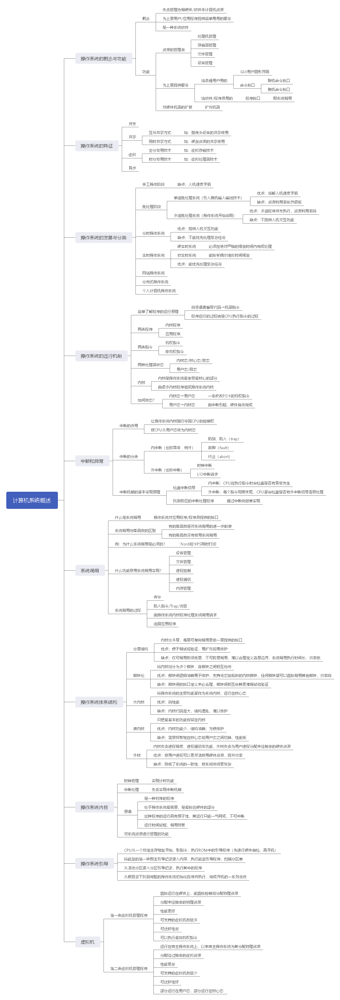
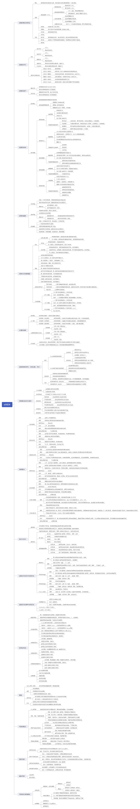
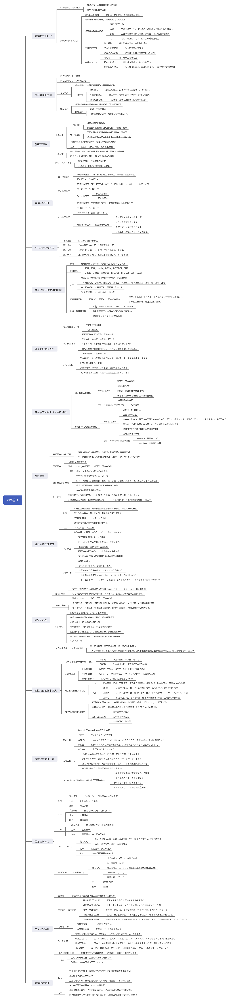

# 操作系统

* [计算机系统概述](#计算机系统概述)
* [进程管理](#进程管理)
* [内存管理](#内存管理)
* [文件管理]
* [输入输出管理](#输入输出管理)

## 计算机系统概述

> 设计现代操作系统的主要目标是什么？

> 操作系统的作用可表现在哪几个方面？

> 为什么说操作系统实现了对计算机资源的抽象？

> 试说明推动多道批处理系统形成和发展的主要动力是什么。

> 何谓脱机 I/O 和联机 I/O ？

> 试说明推动分时系统形成和发展的主要动力是什么？

> 实现分时系统的关键问题是什么？应如何解决？

> 为什么要引入实时操作系统？

> 什么是硬实时任务和软实时任务？试举例说明。

> 试从交互性、及时性以及可靠性方面将分时系统与实时系统进行比较。

> 操作系统有哪几大特征？其最基本的特征是什么？

> 在多道程序技术的操作系统环境下的资源共享与一般情况下的资源共享有何不同？对独占资源应采取何种共享方式？

> 什么是时分复用技术？举例说明它能提高资源利用率的根本原因是什么。

> 是什么原因使操作系统具有异步性特征？

> 处理机管理有哪些主要功能？其主要任务是什么？

> 内存管理有哪些主要功能？其主要任务是什么？

> 设备管理有哪些主要功能？其主要任务是什么？

> 文件管理有哪些主要功能？其主要任务是什么？

> 试说明推动传统操作系统演变为现代操作系统的主要因素是什么？

> 什么是微内核操作系统？

> 微内核操作系统具有哪些优点？它为何能有这些优点？

> 现代操作系统较之传统操作系统又增加了哪些功能和特征？

> 在微内核操作系统中，为什么要采用客户/服务器模式？

> 在基于微内核结构的操作系统中，应用了哪些新技术？

> 何谓微内核技术？在微内核中通常提供了哪些功能？

> 简述现代计算机系统的组成及其层次结构。

> 试述计算机系统的用户视图与程序员视图。

> 什么是操作系统？操作系统在计算机系统中的主要作用是什么？

> 什么是批处理操作系统？什么是分时操作系统？什么是实时操作系统？

> 计算机系统的资源类型可分为哪些类型？试举例说明。

> 什么是多道程序设计？多道程序设计有哪些特点？

> 操作系统的操作控制接口可分为哪些类型？试简述之。

> 什么是系统调用？可分为哪些类型？

> 试简述现代操作系统常用人机交互方式。

> 什么是 WIWP 界面？

> 什么是虚拟现实系统？试述其基本思路。

> 组成操作系统的构件有哪些？试简单叙述之。

> 什么是操作系统内核？

> 解释单内核操作系统与微内核操作系统的区别及其优缺点。

> 试述操作系统资源管理主要技术：资源复用、资源虚拟和资源抽象。

> 试述操作系统三个基础抽象：进程抽象、虚存抽象和文件抽象。

## 进程管理

> 什么是前趋图？为什么要引入前趋图？

> 试画出下面四条语句的前趋图：S1：a = x + y ， S2：b = z + 1 ， S3：c = a - b ， S4：w = c + 1

> 为什么程序并发执行会产生间断性特征？

> 程序并发执行时为什么会失去封闭性和可再现性？

> 在操作系统中为什么要引入进程的概念？它会产生什么样的影响？

> 试从动态性、并发性和独立性上比较进程和程序。

> 试说明 PCB 的作用具体表现在哪几个方面？为什么说 PCB 是进程存在的唯一标志？

> PCB 提供了进程管理和进程调度所需要的哪些信息？

> 进程控制块的组织方式有哪几种？

> 何谓操作系统内核？内核的主要功能是什么？

> 试说明进程在三个基本状态之间转换的典型原因。

> 为什么要引入挂起状态？该状态有哪些性质？

> 在进行进程切换时，所要保存的处理机状态信息有哪些？

> 试说明引起进程创建的主要事件。

> 试说明引起进程被撤销的主要事件。

> 在创建一个进程时所要完成的主要工作是什么？

> 在撤销一个进程时所要完成的主要工作是什么？

> 试说明引起进程阻塞或被唤醒的主要事件是什么？

> 为什么要在操作系统中引入线程？

> 试说明线程具有哪些属性？

> 试从调度性、并发性、拥有资源及系统开销方面对进程和线程进行比较。

> 线程控制块 TCB 中包含了哪些内容？

> 何谓用户级线程和内核支持线程？

> 试说明内核支持线程的实现方法。

> 多线程模型有哪几种类型？多对一模型有何优缺点？

> 高级调度与低级调度的主要任务是什么？为什么要引入中级调度？

> 处理机调度算法的共同目标是什么？批处理系统的调度目标又是什么？

> 何谓作业、作业步和作业流？

> 在什么情况下需要使用作业控制块 JCB ，其中包含了哪些内容？

> 在作业调度中应如何确定接纳多少个作业和接纳哪些作业？

> 为什么要引入高响应比优先调度算法？它有何优点？

> 试说明低级调度的主要功能。

> 在抢占调度方式中，抢占的原则是什么？

> 在选择调度方式和调度算法时，应遵循的准则是什么？

> 在批处理系统、分时系统和实时系统中，各采取哪几种进程（作业）调度算法？

> 何谓静态和动态优先级？确定静态优先级的依据是什么？

> 试比较 FCFS 和 SJF 两种进程调度算法。

> 在时间片轮转法中，应如何确定时间片的大小？

> 通过一个例子来说明通常的优先级调度算法为什么不能适用于实时系统？

> 为什么说多级反馈队列调度算法能较好地满足各方面用户的需要？

> 为什么说传统的几种调度算法都不能算是公平调度算法？

> 保证调度算法是如何做到调度的公平性的？

> 公平分享调度算法又是如何做到调度的公平性的？

> 为什么在实时系统中，要求系统（尤其是 CPU ）具有较强的处理能力？

> 按调度方式可将实时调度算法分为哪几种？

> 什么是最早截止时间优先调度算法？举例说明之。

> 什么是最低松弛度优先调度算法？举例说明之。

> 何谓“优先级倒置”现象，可采取什么方式来解决？

> 试分别说明可重用资源和可消耗资源的性质。

> 试举例说明竞争不可抢占资源所引起的死锁。

> 为了破坏“请求和保持”条件而提出了两种协议，试比较这两种协议。

> 何谓死锁？产生死锁的原因和必要条件是什么？

> 在解决死锁问题的几个方法中，哪种方法最易于实现？哪种方法使资源利用率最高？

> 请详细说明可通过哪些途径预防死锁。

> 什么是程序状态字（PSW）？它有何作用？

> 为什么将机器指令分成特权指令和非特权指令？

> 为什么说操作系统是由中断驱动的？试述中断在操作系统中的作用。

> 试根据中断请求信号的来源对中断事件进行分类。

> 硬件是如何发现与响应中断事件的？操作系统是如何处理中断事件的？

> 什么是中断屏蔽？哪些中断事件可被屏蔽？什么是中断优先级？为什么要为中断事件划分等级？

> 什么是进程？操作系统为什么要引入进程的概念？

> 进程最基本的状态有哪些？哪些事件可能引起不同状态间的转换？

> 进程新建态和终止态的主要作用分别是什么？

> 什么是进程的挂起状态？

> 什么是进程控制块（PCB）？它包含哪些基本信息？

> 什么是进程上下文？试述其主要内容。

> 什么是进程切换？什么是模式切换？试述两种切换的主要步骤并对它们进行比较。

> 试述多线程环境中进程和线程的定义。

> 什么是内核级线程？什么是用户级线程？什么是混合式线程？试对它们进行比较。

> 试述作业、进程、线程和程序之间的关系。

> 处理器调度分为哪几种类型？简述各类调度的主要任务。

> 在时间片轮转调度算法中，可根据哪些因素确定时间片的长度？

> 为什么分级调度算法能较好地满足各种用户的需求？

> 在分级调度算法中，为什么对不同就绪队列中的进程规定使用不同长度的时间片？

> 试述顺序程序设计的特点以及采用顺序程序设计的优缺点。

> 试述并发程序设计的特点以及采用并发程序设计的优缺点。

> 解释并发进程的无关性和交互性。

> 两个交互的并发进程在执行过程中可能产生与时间有关的错误，试举例说明这类错误的表现形式。

> 试述进程互斥和进程同步之间的异同。

> 什么是临界区？什么是临界资源？什么是竞争条件？

> 试述临界区管理的基本原则。

> 哪些硬件设施可以实现临界区管理？简述其用法。

> 什么是信号量？

> 为什么 PV 操作均为不可分割的原语操作？

> 什么是管程？试比较管程与进程的不同点。

> 试述管程中的条件变量的含义和作用。

> 试述霍尔管程的实现方法。

> 进程的低级通信工具和高级通信工具分别有哪些？

> 试述信件、信箱的概念并给出间接通信原语的形式。

> 已有信号量和 PV 操作可用做同步工具，为什么还要考虑进程间的高级通信机制？

> 试述产生死锁的必要条件。

> 列举死锁的各种防止策略。

> 什么是银行家算法？试述其基本思想。

> 如何判断系统内是否发生死锁？列举死锁的解除方法。

## 内存管理

> 为什么要配置层次式存储器？

> 可采用哪几种方式将程序装入内存？它们分别适用于何种场合？

> 何谓静态链接？静态链接时需要解决两个什么问题？

> 何谓装入时动态链接？装入时动态链接方式有何优点？

> 何谓运行时动态链接？运行时动态链接方式有何优点？

> 在动态分区分配方式中，应如何将各空闲分区链接成空闲分区链？

> 为什么要引入动态重定位？如何实现？

> 什么是基于顺序搜索的动态分区分配算法？它可分为哪几种？

> 在采用首次适应算法回收内存时，可能出现哪几种情况？应怎样处理这些情况？

> 什么是基于索引搜索的动态分区分配算法？它可分为哪几种？

> 分区存储管理中常用哪些分配策略？比较它们的优缺点。

> 为什么要引入对换？对换可分为哪几种类型？

> 对文件区管理的目标和对对换空间管理的目标有何不同？

> 为实现对换，系统应具备哪几方面的功能？

> 在以进程为单位进行对换时，每次是否都将整个进程换出？为什么？

> 基于离散分配时所用的基本单位不同，可将离散分配分为哪几种？

> 什么是页面？什么是物理块？页面的大小应如何确定？

> 什么是页表？页表的作用是什么？

> 为实现分页存储管理，需要哪些硬件支持？

> 在分页系统中是如何实现地址变换的？

> 具有快表时是如何实现地址变换的？

> 较详细地说明引入分段存储管理是为了满足用户哪几方面的需要。

> 在具有快表的段页式存储管理方式中，如何实现地址变换？

> 为什么说分段系统比分页系统更易于实现信息的共享和保护？

> 分页和分段存储管理有何区别？

> 试全面比较连续分配和离散分配方式。

> 常规存储器管理方式具有哪两大特征？它对系统性能有何影响？

> 什么是程序运行时的时间局限性和空间局限性？

> 虚拟存储器有哪些特征？其中最本质的特征是什么？

> 实现虛拟存储器需要哪些硬件支持？

> 实现虚拟存储器需要哪几个关键技术？

> 在请求分页系统中，页表应包括哪些数据项？每项的作用是什么？

> 试比较缺页中断机构与一般的中断，它们之间有何明显的区别？

> 试说明请求分页系统中的地址变换过程。

> 何谓固定分配局部置换和可变分配全局置换的内存分配策咯？

> 在请求分页系统中，应从何处将所需页面调入内存？

> 试说明在请求分页系统中页面的调入过程。

> 在请求分页系统中，常采用哪几种页面置换算法？

> 在一个请求分页系统中，采用 FIFO 页面置换算法时，假如一个作业的页面走向为 4、3、2、1、4、3、5、4、3、2、1、5，当分配给该作业的物理块数 M 分别为 3 和 4 时，试计算在访问过程中所发生的缺页次数和缺页率，并比较所得结果。

> 实现 LRU 算法所需的硬件支持是什么？

> 试说明改进型 Clock 置换算法的基本原理。

> 影响页面换进换出效率的若干因素是什么？

> 页面缓冲算法的主要特点是什么？它是如何降低页面换进、换出的频率的？

> 在请求分页系统中，产生“抖动”的原因是什么？

> 何谓工作集？它是基于什么原理确定的？

> 当前可以利用哪几种方法来防止“抖动”？

> 试说明如何利用 “L=S” 准则来调节缺页率，以避免“抖动”的发生。

> 为了实现请求分段式存储管理，应在系统中增加配置哪些硬件机构？

> 在请求段表机制中，应设置哪些段表项？

> 说明请求分段系统中的缺页中断处理过程。

> 请对共享段表中的各项作简要说明。

> 如何实现共享分段的分配和回收？

> 试述存储管理的基本功能。

> 什么是逻辑地址？什么是物理地址？

> 什么是地址转换？哪些方法可以实现地址转换？

> 什么是虚拟存储器？列举采用虚拟存储技术的必要性和可能性。

> 试讨论虚拟存储器容量与地址总线宽度、内存容量及外存容量之间的关系。

> 试述计算机系统中存储器的组织层次。为什么要配置层次式存储器？

> 什么是存储保护？ 在分区存储管理中如何实现分区的存储保护？

> 可交分区存储管理中常采用哪些分配策略？比较这些分配算法的优缺点。

> 在可变分区存储管理中，回收一个分区时有多种不同的邻接情况，试讨论各种情况的处理方法。

> 什么是移动技术？应在什么情况下采用这种技术？

> 在页式存储器中实现程序共享时，共享程序的页号是否一定要相同？为什么？

> 在页式存储管理中，决定页面大小的主要因素是什么？

> 试述页式虚拟存储管理的实现原理。

> 实现页式虚拟存储器必须要有哪些软硬件支撑？

> 试述缺页中断与一般中断之问的区别。

> 什么是抖动？试述抖动产生的主要原因。

> 在段式存储器中实现程序共享时，共享段的段号是否一定要相同？为什么？

> 试述段式虚拟存储管理的实现原理。

> 试述段页式虚拟存储管理的实现原理。

## 文件管理

> 何谓数据项、记录和文件？

> 文件系统的模型可分为三层，试说明其每一层所包含的基本内容。

> 与文件系统有关的软件可分为哪几个层次？

> 试说明用户可以对文件施加的主要操作有哪些。

> 为什么在大多数 OS 中都引入了“打开”的这一文件系统调用，打开的含义是什么？

> 何谓文件的逻辑结构？何谓文件的物理结构？

> 按文件的组织方式可将文件分为哪几种类型？

> 如何提高对变长记录顺序文件的检索速度？

> 通过哪两种方式来对固定长记录实现随机访问？

> 可以采取什么方法来实现对变长记录文件进行随机检索？

> 试说明索引顺序文件的几个主要特征。

> 试说明对索引文件和索引顺序文件的检索方法。

> 试从检索速度和存储费用两方面来比较两级索引文件和索引顺序文件。

> 对目录管理的主要要求是什么？

> 采用单级目录能否满足对目录管理的主要要求？为什么？

> 目前广泛采用的目录结构形式是哪种？它有什么优点？

> 何谓路径名和当前目录？

> Hash 检索法有何优点？又有何局限性？

> 在 Hash 检索法中，如何解决“冲突”问题？

> 试说明在树形目录结构中线性检索法的检索过程，并给出相应的流程图。

> 基于索引结点的文件共享方式有何优点？

> 什么是主父目录和链接父目录？如何利用符号链实现共享？

> 基于符号链的文件共享方式有何优点？

> 什么是保护域？进程与保护域之间存在着的动态联系是什么？

> 试举例说明具有域切换权的访问控制矩阵。

> 如何利用拷贝权来扩散某种访问权？

> 如何利用拥有权来增、删某种访问权？

> 增加控制权的主要目的是什么？试举例说明控制权的应用。

> 什么是访问控制表？什么是访问权限表？

> 系统如何利用访问控制表和访问权限表来实现对文件的保护？

> 分别给出卷、块、记录、文件的定义并说明它们之间的关系。

> 列举文件系统面向用户的主要功能。

> 什么是文件的逻辑结构？它有哪几种组织方式？

> 什么是文件的物理结构？它有哪几种组织方式？

> 什么是记录的成组和分解操作？采用这种技术有什么优点？

> 为了实现快速访问且易于更新的目标，当数据分别为以下形式时，应选用何种文件组织方式？（1）不经常更新,经常随机访问；（2）经常更新，按照一定的顺序访问；（3）经常更新，经常随机访问。

> 什么是直接文件？该类文件适用于哪些应用场景？

> 试述直接文件解决冲突问题的方法。

> 什么是按名存取？文件系统如何实现文件的按名存取？

> 常见的文件目录结构有哪些？试分别列举它们的优缺点。

> 什么是文件控制块（FCB）？

> 什么是文件目录？什么是目录文件？

> 试分别解释根目录、父目录、子目录以及当前目录的含义。

> 试分别解释文件路径名、绝对路径名和相对路径名的概念。

> 什么是文件共享？

> 文件系统提供的副本技术有哪些？试述各种方法的优缺点。

> 文件系统提供的系统调用有哪些？试述各自的主要功能。

> 试述打开文件及关闭文件的处理过程。

> 试述辅存文件空间的分配方法。

> 试述文件系统的层次结构及各层次的主要功能。

## 输入输出管理

> 试说明 I/O 系统的基本功能。

> 简要说明 I/O 软件的四个层次的基本功能。

> I/O 系统接口与软件/硬件（RW/HW）接口分别是什么接口？

> 与设备无关性的基本含义是什么？为什么要设置该层？

> 试说明设备控制器的组成。

> 为了实现 CPU 与设备控制器间的通信，设备控制器应具备哪些功能？

> 什么是内存映像 I/O ？它是如何实现的？

> 为什么说中断是 OS 赖以生存的基础？

> 对多中断源的两种处理方式分别用于何种场合？

> 设备中断处理程序通常需完成哪些工作？

> 简要说明中断处理程序对中断进行处理的几个步骤。

> 试说明设备驱动程序具有哪些特点。

> 设备驱动程序通常要完成哪些工作？

> 简要说明设备驱动程序的处理过程可分为哪几步。

> 试说明推动 I/O 控制发展的主要因素是什么。

> 有哪几种 I/O 控制方式？各适用于何种场合？

> 试说明 DMA 的工作流程。

> 为何要引入与设备的无关性？如何实现设备的独立性？

> 与设备的无关的软件中，包括了哪些公有操作的软件？

> 在考虑到设备的独立性时，应如何分配独占设备？

> 何谓设备虚拟？实现设备虛拟时所依赖的关键技术是什么？

> 在实现后台打印时， SPOOLing 系统应为请求 I/O 的进程提供哪些服务？

> 假脱机系统向用户提供共享打印机的基本思想是什么？

> 引入缓冲的主要原因是什么？

> 在单缓冲情况下，为什么系统对一块数据的处理时间为 max(C, T) + M ？

> 为什么在双缓冲情况下，系统对一块数据的处理时间为 max(T, C) ？

> 试说明收容输入工作缓冲区和提取输出工作缓冲区的工作情况。

> 何谓安全分配方式和不安全分配方式？

> 磁盘访问时间由哪几部分组成？每部分时间应如何计算？

> 目前常用的磁盘调度算法有哪几种？每种算法优先考怎的问题是什么？

> 试述设备管理的基本功能。

> I/O 设备可分为哪些类型？ 各类设备的物理特点是什么？

> 块设备文件和字符设备文件的本质区别是什么？

> I/O 控制方式可分为哪些类型？各类控制方式的优缺点有哪些？

> 试述采用直接存储器存取（DMA）方式实现 I/O 控制的工作原理。

> 大型机常常采用通道方式实现 I/O 控制，那么什么是通道？ 为什么要引入通道？

> 试述采用通道技术时 I/O 操作的全过程。

> 试述 I/O 软件的分层结构及各层次的主要功能。

> 为什么要引入缓冲技术？其基本思想是什么？

> 试述常用的缓冲技术。

> I/O 设备与 CPU 并行工作的基础是什么？

> 为什么要引入设备独立性？如何实现设备独立性？

> 什么是设备的静态分配？什么是设备的动态分配？

> 设备分配中有可能出现死锁吗？试说明原因。

> 什么是磁盘的驱动调度？目前常用的磁盘驱动调度算法有哪些？

> 什么是虚拟设备？实现虚拟设备的主要条件是什么？

> 什么是井？什么是输入井？什么是输出井？试述井管理程序的基本功能及工作原理。

> SPOOLing 系统是如何将独占型设备改造成共享型设备的？
