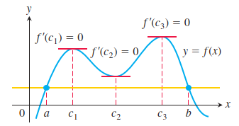

# 罗尔定理

* [定理内容](#定理内容)
* [经典例题](#经典例题)
  * [例题一](#例题一)

## 定理内容

$$
定义：如果函数 f(x) 满足在闭区间 [a , b] 上连续，在开区间 (a , b) 内可导，且在区间端点处的函数值相等，即 f(a) = f(b) ，
\\
那么在 (a , b) 内至少存在一点 \xi (a \lt \xi \lt b) ，使得 f(\xi)\prime = 0 .
$$

## 经典例题

### 例题一

$$
如：设 a_0 + \frac{1}{2}a_1 + \cdots + \frac{a_n}{n + 1} = 0 ， 证明 a_0 + {a_1}x + \cdots + {a_n}x ^ n 至少存在一个正根.
\\
证明如下：令 y = a_0 + \frac{1}{2}a_1 + \cdots + \frac{a_n}{n + 1} = 0 ， f(x) = a_0 + {a_1}x + \cdots + {a_n}x ^ n ，
\\
再令 F(x) = {a_0}x + \frac{a_1}{2}x ^ 2 + \cdots + \frac{a_n}{n + 1}x ^ {n + 1} ，
\\
\therefore F(x)\prime = f(x) ，且 F(0) = F(1) = y = 0 ，
\\
\therefore 由罗尔定理可得， \exists\xi \in (0 , 1) ，使得 F(\xi)\prime = 0 ，即 f(\xi) = 0 ，
\\
\therefore f(x) = a_0 + {a_1}x + \cdots + {a_n}x ^ n 至少存在一个正根.
$$

