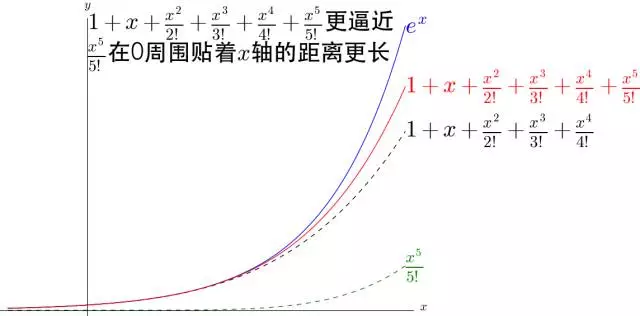
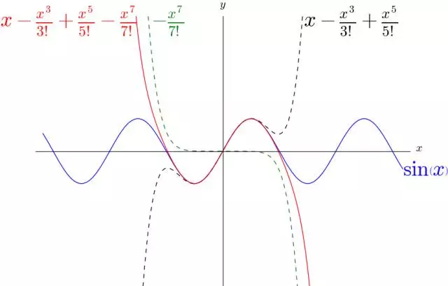

# 泰勒公式

* [定理内容](#定理内容)
* [常用泰勒公式](#常用泰勒公式)

## 定理内容

$$
带有拉格朗日余项的泰勒公式： f(x) = f(x_0) + f(x_0)\prime(x - x_0) + \frac{f(x_0)\prime\prime}{2!}(x - x_0) ^ 2 + \cdots + \frac{f(x_0) ^ {(n)}}{n!}(x - x_0) ^ n
\\
+ \frac{f(x_0 + \theta(x - x_0)) ^ {(n + 1)}}{(n + 1)!}(x - x_0) ^ {n + 1} (0 \lt \theta \lt 1) .
$$

$$
带有拉格朗日余项的麦克劳林公式： f(x) = f(0) + f(0)\prime{x} + \frac{f(0)\prime\prime}{2!}x ^ 2 + \cdots + \frac{f(0) ^ {(n)}}{n!}x ^ n + \frac{f(\theta{x}) ^ {(n + 1)}}{(n + 1)!}x ^ {n + 1} (0 \lt \theta \lt 1) .
$$

$$
带有佩亚诺余项的泰勒公式： f(x) = f(x_0) + f(x_0)\prime(x - x_0) + \frac{f(x_0)\prime\prime}{2!}(x - x_0) ^ 2 + \cdots + \frac{f(x_0) ^ {(n)}}{n!}(x - x_0) ^ n + o((x - x_0) ^ n) .
$$

$$
带有佩亚诺余项的麦克劳林公式： f(x) = f(0) + f(0)\prime{x} + \frac{f(0)\prime\prime}{2!}x ^ 2 + \cdots + \frac{f(0) ^ {(n)}}{n!}x ^ n + o(x ^ n) .
$$

## 常用泰勒公式

$$
e ^ x = 1 + \frac{x}{1!} + \frac{x ^ 2}{2!} + \cdots + \frac{x ^ n}{n!} + o(x ^ n)
\\
\ln(x + 1) = x - \frac{x ^ 2}{2} + \frac{x ^ 3}{3} - \cdots + (-1) ^ {n - 1} \cdot \frac{x ^ n}{n} + o(x ^ n)
\\
\sin{x} = x - \frac{x ^ 3}{3!} + \frac{x ^ 5}{5!} - \cdots + (-1) ^ n \cdot \frac{x ^ {2n + 1}}{(2n + 1)!} + o(x ^ {2n + 1})
\\
\arcsin{x} = x + \frac{x ^ 3}{6} + \frac{3{x ^ 5}}{40} + \cdots + \frac{35{x ^ 9}}{1152} + o(x ^ 9)
\\
\cos{x} = 1 - \frac{x ^ 2}{2!} + \frac{x ^ 4}{4!} - \cdots + (-1) ^ n \cdot \frac{x ^ {2n}}{(2n)!} + o(x ^ {2n})
\\
\tan{x} = x + \frac{x ^ 3}{3} + \frac{2{x ^ 5}}{15} + \cdots + (-1) ^ {n - 1} \cdot \frac{2 ^ {2n}(2 ^ {2n} - 1)B_{2n}x ^ {2n - 1}}{(2n)!} + o(x ^ {2n - 1})
\\
\arctan{x} = x - \frac{x ^ 3}{3} + \frac{x ^ 5}{5} - \cdots + (-1) ^ n \cdot \frac{x ^ {2n + 1}}{2n + 1} + o(x ^ {2n + 1})
\\
\frac{1}{1 - x} = 1 + x + x ^ 2 + \cdots + x ^ n + o(x ^ n)
\\
\frac{1}{1 + x} = 1 - x + x ^ 2 - \cdots + (-1) ^ n \cdot x ^ n + o(x ^ n)
\\
(x + 1) ^ a = 1 + ax + \frac{a(a - 1)}{2!}x ^ 2 + \cdots + \frac{a(a - 1) \cdots (a - n + 1)}{n!}x ^ n + o(x ^ n)
$$

