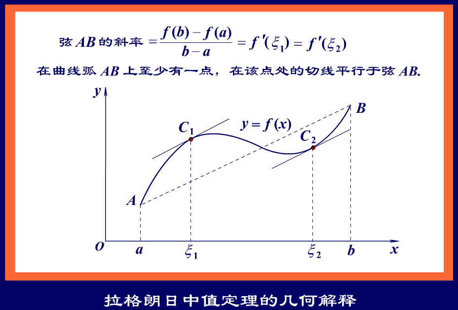

# 拉格朗日中值定理

$$
定义：如果函数 f(x) 满足在闭区间 [a , b] 上连续，在开区间 (a , b) 内可导，那么在 (a , b) 内至少存在一点 \xi (a < \xi < b) ，使得 f(\xi)\prime = \frac{f(b) - f(a)}{b - a} .
$$

$$
以下是用罗尔定理证明拉格朗日中值定理的过程：
\\
令 f(x) 为原函数， g(x) 为辅助函数， F(x) 为满足罗尔定理的函数，则 F(x) = f(x) - g(x) ，
\\
构造辅助函数为： y - f(a) = \frac{f(b) - f(a)}{b - a}(x - a) ，
\\
\therefore y = \frac{f(b) - f(a)}{b - a}(x - a) + f(a) ，即 g(x) = \frac{f(b) - f(a)}{b - a}(x - a) + f(a) ，
\\
\therefore F(x) = f(x) - \frac{f(b) - f(a)}{b - a}(x - a) - f(a) ，
\\
\because F(a) = F(b) ，且 \exists\xi \in (a , b) ，使得 F(\xi)\prime = 0 ，
\\
\therefore F(\xi)\prime = f(\xi)\prime - \frac{f(b) - f(a)}{b - a} ，
\\
\therefore f(\xi)\prime - \frac{f(b) - f(a)}{b - a} = 0 ，即 f(\xi)\prime = \frac{f(b) - f(a)}{b - a} ，
\\
\therefore 由此可见，罗尔定理是拉格朗日中值定理的特殊情况.
$$

$$
如：求 \lim_{x \to +\infty}(sin{\sqrt{x + 1}} - sin{\sqrt{x}}) .
\\
令 f(x) = sin{\sqrt{x}} ， f(x + 1) = sin{\sqrt{x + 1}} ，
\\
\therefore \lim_{x \to +\infty}(sin{\sqrt{x + 1}} - sin{\sqrt{x}}) = \lim_{x \to +\infty}\frac{f(x + 1) - f(x)}{(x + 1) - x} ，
\\
由拉格朗日中值定理得， \lim_{x \to +\infty}\frac{f(x + 1) - f(x)}{(x + 1) - x} = \lim_{x \to +\infty}f(\xi)\prime ，
\\
\therefore f(\xi)\prime = cos{\sqrt{\xi}} \cdot \frac{1}{2\sqrt{\xi}} ，
\\
\therefore \lim_{x \to +\infty}f(\xi)\prime = 0 .
$$

$$
如：求 \lim_{x \to \infty}x ^ 2 (arctan{\frac{a}{x}} - arctan{\frac{a}{x + 1}}) .
\\
令 f(x) = arctanx ，则 f(\frac{a}{x}) = arctan{\frac{a}{x}} ， f(\frac{a}{x + 1}) = arctan{\frac{a}{x + 1}} ，
\\
由拉格朗日中值定理得， f(\frac{a}{x}) - f(\frac{a}{x + 1}) = (\frac{a}{x} - \frac{a}{x + 1}) \cdot f(\xi)\prime ，
\\
\therefore \lim_{x \to \infty}x ^ 2 (arctan{\frac{a}{x}} - arctan{\frac{a}{x + 1}}) = \lim_{x \to \infty}x ^ 2 \cdot (\frac{a}{x} - \frac{a}{x + 1}) \cdot f(\xi)\prime = \lim_{x \to \infty}x ^ 2 \cdot (\frac{a}{x} - \frac{a}{x + 1}) \cdot \frac{1}{1 + \xi ^ 2} ，
\\
\because \frac{a}{x + 1} < \xi < \frac{a}{x} ， x \to \infty ，则 \xi \to 0 ，
\\
\therefore \frac{1}{1 + \xi ^ 2} = 1 ，
\\
\therefore \lim_{x \to \infty}x ^ 2 \cdot (\frac{a}{x} - \frac{a}{x + 1}) \cdot \frac{1}{1 + \xi ^ 2} = \lim_{x \to \infty}x ^ 2 \cdot (\frac{a}{x} - \frac{a}{x + 1}) = \lim_{x \to \infty}\frac{a \cdot x ^ 2}{x(x + 1)} = a .
$$

