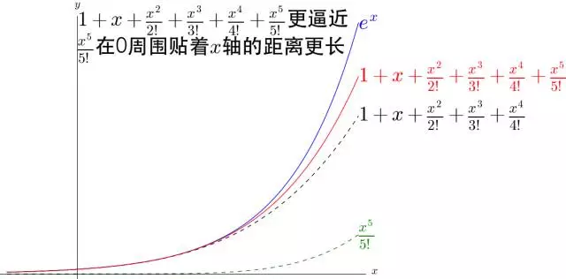
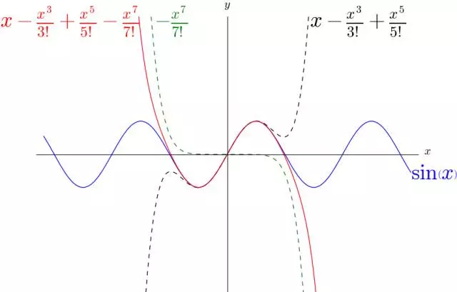

# 泰勒公式

* [定理内容](#定理内容)
* [常用泰勒公式](#常用泰勒公式)
* [经典例题](#经典例题)
  * [例题一](#例题一)
  * [例题二](#例题二)
  * [例题三](#例题三)

## 定理内容

$$
带有佩亚诺余项的麦克劳林公式： f(x) = f(0) + f(0)\prime{x} + \frac{f(0)\prime\prime}{2!}x ^ 2 + \cdots + \frac{f(0) ^ {(n)}}{n!}x ^ n + o(x ^ n) .
$$

$$
带有拉格朗日余项的麦克劳林公式： f(x) = f(0) + f(0)\prime{x} + \frac{f(0)\prime\prime}{2!}x ^ 2 + \cdots + \frac{f(0) ^ {(n)}}{n!}x ^ n + \frac{f(\theta{x}) ^ {(n + 1)}}{(n + 1)!}x ^ {n + 1} (0 \lt \theta \lt 1) .
$$

## 常用泰勒公式

$$
e ^ x = 1 + x + \frac{x ^ 2}{2!} + \cdots + \frac{x ^ n}{n!} + \frac{e ^ {\theta{x}}}{(n + 1)!}x ^ {n + 1} (0 \lt \theta \lt 1)
\\
\sin{x} = x - \frac{x ^ 3}{3!} + \cdots + (-1) ^ {n - 1} \cdot \frac{x ^ {2n - 1}}{(2n - 1)!} + (-1) ^ n \cdot \frac{\cos({\theta}{x})}{(2n + 1)!}x ^ {2n + 1} (0 \lt \theta \lt 1)
\\
cosx = 1 - \frac{x ^ 2}{2!} + \cdots + (-1) ^ n \cdot \frac{x ^ {2n}}{(2n)!} + (-1) ^ {n + 1} \cdot \frac{\cos({\theta}{x})}{(2n + 2)!}x ^ {2n + 2} (0 \lt \theta \lt 1)
\\
\ln ^ {(x + 1)} = x - \frac{x ^ 2}{2} + \cdots + (-1) ^ {n - 1} \cdot \frac{x ^ n}{n} + (-1) ^ n \cdot \frac{x ^ {n + 1}}{(n + 1)(1 + {\theta}{x}) ^ {n + 1}} (0 \lt \theta \lt 1)
\\
(x + 1) ^ a = 1 + ax + \frac{a(a - 1)}{2!} + \cdots + \frac{a(a - 1) \cdots (a - n + 1)}{n!}x ^ n + \frac{a(a - 1) \cdots (a - n + 1)(a - n)}{(n + 1)!}(1 + {\theta}{x}) ^ {a - n - 1}x ^ {n + 1} (0 \lt \theta \lt 1)
$$

## 经典例题

### 例题一

$$
如：写出函数 f(x) = e ^ x 的带有拉格朗日余项的 n 阶麦克劳林公式.
\\
\because f(0) = f(0)\prime = f(0)\prime\prime = \cdots f(0) ^ {(n)} = 1 ，
\\
\because \frac{f(\theta{x}) ^ {(n + 1)}}{(n + 1)!}x ^ {n + 1} = \frac{e ^ {\theta{x}}}{(n + 1)!}x ^ {n + 1} (0 \lt \theta \lt 1) ，
\\
带入朗格朗日余项的麦克劳林公式，得： e ^ x = 1 + x + \frac{1}{2!}x ^ 2 + \cdots + \frac{1}{n!}x ^ n + \frac{e ^ {\theta{x}}}{(n + 1)!}x ^ {n + 1} (0 \lt \theta \lt 1) .
$$

### 例题二

$$
如：求 f(x) = \sin{x} 的带有拉格朗日余项的 n 阶麦克劳林公式.
\\
\because f(0) = 0 ， f(0)\prime = 1 ， f(0)\prime\prime = 0 ， f(0)\prime\prime\prime = -1 ， f(0) ^ {(4)} = 0 ，
\\
\because \frac{f(\theta{x}) ^ {(n + 1)}}{(n + 1)!}x ^ {n + 1} = (-1) ^ n \cdot \frac{\cos{\theta}{x}}{(2n + 1)!}x ^ {2n + 1} ，
\\
带入拉格朗日余项的麦克劳林公式，得： x - \frac{x ^ 3}{3!} + \cdots + (-1) ^ {n - 1} \cdot \frac{x ^ {2n - 1}}{(2n - 1)!} + (-1) ^ n \cdot \frac{\cos({\theta}{x})}{(2n + 1)!}x ^ {2n + 1} (0 \lt \theta \lt 1) .
$$

### 例题三

$$
利用带有佩亚诺余项的麦克劳林公式，求极限 \lim_{x \to 0}\frac{\sin{x} - x\cos{x}}{(\sin{x}) ^ 3} .
\\
由等价无穷小，得： \sin{x} ～ x ，即 (\sin{x}) ^ 3 ～ x ^ 3 ，
\\
\because \sin{x} = x - \frac{1}{3!}x ^ 3 + o(x ^ 3) ， x\cos{x} = x - \frac{1}{2!}x ^ 3 + o(x ^ 4) ，
\\
\therefore \sin{x} - x\cos{x} = (x - \frac{1}{3!}x ^ 3 + o(x ^ 3)) - (x - \frac{1}{2!}x ^ 3 + o(x ^ 4)) = \frac{1}{3}x ^ 3 + o(x ^ 3) ，
\\
\therefore \lim_{x \to 0}\frac{\sin{x} - x\cos{x}}{(\sin{x}) ^ 3} = \frac{\frac{1}{3}x ^ 3 + o(x ^ 3)}{x ^ 3} = \frac{1}{3} .
$$

### 例题四

$$
求函数 f(x) = \sqrt{x} 在 x_0 = 1 处的带有拉格朗日余项的四阶泰勒展开式.
\\
$$

