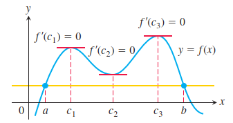
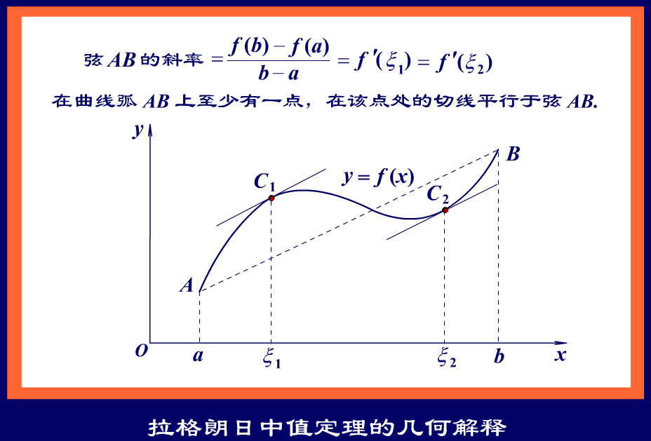

# 中值定理

* [函数中值定理](#函数中值定理)
  * [有界与最值定理](#有界与最值定理)
  * [介值定理](#介值定理)
  * [平均值定理](#平均值定理)
  * [零点定理](#零点定理)
* [导数中值定理](#导数中值定理)
  * [导数零点定理](#导数零点定理)
  * [费马定理](#费马定理)
  * [罗尔定理](#罗尔定理)
  * [拉格朗日中值定理](#拉格朗日中值定理)
  * [柯西中值定理](#柯西中值定理)
* [经典例题](#经典例题)

## 函数中值定理

### 有界与最值定理

$$
设 f(x) 在 [a , b] 上连续，则 m \le f(x) \le M ，其中 m ， M 分别为 f(x) 在 [a , b] 上的最小值与最大值.
$$

### 介值定理

$$
设 f(x) 在 [a , b] 上连续， m ， M 分别为 f(x) 在 [a , b] 上的最小值与最大值，当 m \le \mu \le M ，存在 \xi \in [a , b] ，使得 f(\xi) = \mu .
$$

### 平均值定理

$$
设 f(x) 在 [a , b] 上连续，当 a \lt x_1 \lt x_2 \lt \cdots \lt x_n \lt b 时，在 [x_1 , x_n] 内至少存在一点 \xi ，使得 f(\xi) = \frac{f(x_1) + f(x_2) + \dots + f(x_n)}{n} .
$$

### 零点定理

$$
设 f(x) 在 [a , b] 上连续，当 f(a)f(b) \lt 0 ，存在 \xi \in (a , b) ，使得 f(\xi) = 0 .
$$

## 导数中值定理

### 导数零点定理

$$
设 f(x) 在 [a , b] 上可导，当 {f ^ {\prime} _{+}(a)}{f ^ {\prime} _{-}(b)} \lt 0 时，存在 \xi \in (a , b) ，使得 f ^ {\prime} (\xi) = 0 .
$$

### 费马定理

$$
设 f(x) 在点 x_0 处可导，且取得极值，则 f ^ {\prime} (x_0) = 0 .
$$

### 罗尔定理

$$
设 f(x) 在 [a , b] 上连续，在 (a , b) 内可导，且 f(a) = f(b) ，则存在 \xi \in (a , b) ，使得 f ^ {\prime} (\xi) = 0 .
$$

$$
罗尔定理的使用往往需要构造辅助函数，如：
\\
f(x)f ^ {\prime} (x) \Rightarrow F(x) = f(x) ^ 2 ，
\\
[f ^ {\prime} (x)] ^ 2 + f(x)f ^ {\prime\prime} (x) \Rightarrow F(x) = f(x)f ^ {\prime} (x) ，
\\
f ^ {\prime} (x) + {f(x)}{\phi ^ {\prime} (x)} \Rightarrow F(x) = f(x){e ^ {\phi(x)}} ，
\\
f(x) + f ^ {\prime} (x) \Rightarrow F(x) = f(x){e ^ x} ，
\\
f(x) - f ^ {\prime} (x) \Rightarrow F(x) = f(x){e ^ {-x}} ，
\\
f ^ {\prime} (x) + kf(x) \Rightarrow F(x) = f(x){e ^ {kx}} ，
\\
{f ^ {\prime} (x)}x - f(x) \Rightarrow F(x) = \frac{f(x)}{x} ，
\\
{f ^ {\prime\prime} (x)}f(x) - [f ^ {\prime} (x)] ^ 2 \Rightarrow F(x) = \frac{f ^ {\prime} (x)}{f(x)} ，
\\
{f ^ {\prime\prime} (x)}f(x) - [f ^ {\prime} (x)] ^ 2 \Rightarrow F(x) = \ln{f(x)} .
$$

### 拉格朗日中值定理

$$
设 f(x) 在 [a , b] 上连续，在 (a , b) 内可导，则存在 \xi \in (a , b) ，使得 f(b) - f(a) = f ^ {\prime} (\xi)(b - a) ，或者 f ^ {\prime} (\xi) = \frac{f(b) - f(a)}{b - a} .
$$

### 柯西中值定理

$$
设 f(x) ， g(x) 满足在 [a , b] 上连续，在 (a , b) 内可导，则存在 \xi \in (a , b) ，使得 \frac{f(b) - f(a)}{g(b) - g(a)} = \frac{f ^ {\prime} (\xi)}{g ^ {\prime} (\xi)} .
$$

## 经典例题

$$
如：设 f(x) 在 [0 , 3] 上连续，在 (0 , 3) 内可导，且 f(0) + f(1) + f(2) = 3 ， f(3) = 1 ，证明存在 \xi \in (0 , 3) ，使得 f ^ {\prime} (\xi) = 0 .
\\
证明如下： \because 由平均值定理可得， \exists{a} \in [0 , 2] ， 使得 f(a) = \frac{f(0) + f(1) + f(2)}{3} = 1 ，
\\
\therefore 由罗尔定理可得， \exists\xi \in (a , 3) \subset (0 , 3) ，使得 f ^ {\prime} (\xi) = 0 .
$$

$$
如：设 a_0 + \frac{1}{2}a_1 + \cdots + \frac{a_n}{n + 1} = 0 ， 证明 a_0 + {a_1}x + \cdots + {a_n}x ^ n 至少存在一个正根.
\\
证明如下：令 y = a_0 + \frac{1}{2}a_1 + \cdots + \frac{a_n}{n + 1} = 0 ， f(x) = a_0 + {a_1}x + \cdots + {a_n}x ^ n ，
\\
构造辅助函数 F(x) = {a_0}x + \frac{a_1}{2}x ^ 2 + \cdots + \frac{a_n}{n + 1}x ^ {n + 1} ，
\\
\therefore F ^ {\prime} (x) = f(x) ，且 F(0) = F(1) = y = 0 ，
\\
\therefore 由罗尔定理可得， \exists\xi \in (0 , 1) ，使得 F ^ {\prime} (\xi) = 0 ，即 f(\xi) = 0 ，
\\
\therefore f(x) = a_0 + {a_1}x + \cdots + {a_n}x ^ n 至少存在一个正根.
$$

$$
如：设函数 f(x) 在区间 [0 , 1] 上具有二阶导数，且 f(1) \gt 0 ， \lim_{x \to 0+} \frac{f(x)}{x} \lt 0 ，证明方程 f(x)f ^ {\prime\prime} (x) + [f ^ {\prime} (x)] ^ 2 = 0 在区间 [0 , 1] 内至少存在两个不同实根.
\\
证明如下： \because \lim_{x \to 0+} \frac{f(x)}{x} \lt 0 ，
\\
\therefore f(0) = 0 ，且 \exists{a} \in (0 , 1) ，使得 \frac{f(a)}{a} \lt 0 ，
\\
\therefore 由零点定理可得， \exists{b} \in (a , 1) \subset (0 , 1) ，使得 f(b) = 0 ，
\\
\therefore 由罗尔定理可得， \exists{c} \in (0 , b) \subset (0 , 1) ，使得 f ^ {\prime} (c) = 0 ，
\\
构造辅助函数 F(x) = f(x)f ^ {\prime} (x) ，
\\
\therefore F ^ {\prime} (x) = f(x) ，且 F(0) = F(b) = F(c) = 0 ，
\\
\therefore 由罗尔定理可得， \exists\xi \in (0 , b) \subset (0 , 1) ， \exists\eta \in (b , c) \subset (0 , 1) ，
\\
使得 F ^ {\prime} (\xi) = F ^ {\prime} (\eta) = 0 ，
\\
\therefore 方程在区间 [0 , 1] 内至少存在两个不同实根.
$$

$$
如：设 f(x) 在 [0 , 1] 上连续，在 (0 , 1) 内可导， f(0) = 0 ，且 f(x) 在 [0 , 1] 上不恒等于零，证明存在 \xi \in (0 , 1) ，使得 f(\xi)f ^ {\prime} (\xi) \gt 0 .
\\
证明如下：构造辅助函数 F(x) = \frac{1}{2}f(x) ^ 2 ，
\\
\therefore F ^ {\prime} (x) = f(x) ，且 F(0) = \frac{1}{2}f(0) ^ 2 = 0 ，
\\
\because f(x) 在 [0 , 1] 上不恒等于零，则 \exists{a} \in (0 , 1] ，使得 f(a) \neq 0 ，且 F(a) \gt 0 ，
\\
\therefore 由拉格朗日中值定理可得， \exists{\xi} \in (0 , 1) ，使得 F ^ {\prime} (\xi) = \frac{F(a) - F(0)}{a - 0} = \frac{F(a)}{a} \gt 0 ，
\\
\therefore f(\xi)f ^ {\prime} (\xi) \gt 0 .
$$

$$
如：求 \lim_{x \to +\infty} (\sin{\sqrt{x + 1}} - \sin{\sqrt{x}}) .
\\
令 f(x) = \sin{\sqrt{x}} ，则 \sin{\sqrt{x + 1}} - \sin{\sqrt{x}} = f(x + 1) - f(x) ，
\\
由拉格朗日中值定理可得， f(b) - f(a) = f ^ {\prime} (\xi) (b - a) ，
\\
\therefore f(x + 1) - f(x) = f ^ {\prime} (\xi) (x + 1 - x) ，即 f(x + 1) - f(x) = f ^ {\prime} (\xi) ，
\\
\because f ^ {\prime} (\xi) = \cos{\sqrt{\xi}} \cdot \frac{1}{2\sqrt{\xi}} ，
\\
\because x < \xi < x + 1 ，当 x \to +\infty ， \xi \to +\infty ，
\\
\therefore \lim_{x \to +\infty} f ^ {\prime} (\xi) = 0 ，
\\
\therefore \lim_{x \to +\infty} (\sin{\sqrt{x + 1}} - \sin{\sqrt{x}}) = 0 .
$$

$$
如：求 \lim_{x \to \infty}{x ^ 2}(\arctan{\frac{a}{x}} - \arctan{\frac{a}{x + 1}}) .
\\
令 f(x) = \arctan{x} ，则 {x ^ 2}(\arctan{\frac{a}{x}} - \arctan{\frac{a}{x + 1}}) = {x ^ 2}(f(\frac{a}{x}) - f(\frac{a}{x + 1})) ，
\\
由拉格朗日中值定理可得， f(b) - f(a) = f ^ {\prime} (\xi) (b - a) ，
\\
\therefore f(\frac{a}{x}) - f(\frac{a}{x + 1}) = f ^ {\prime} (\xi) (\frac{a}{x} - \frac{a}{x + 1}) ，
\\
\because f ^ {\prime} (\xi) = \frac{1}{1 + \xi ^ 2} ，
\\
\because \frac{a}{x + 1} < \xi < \frac{a}{x} ，当 x \to \infty ， \xi \to 0 ，
\\
\therefore \lim_{x \to \infty} f ^ {\prime} (\xi) = 1 ，
\\
\therefore \lim_{x \to \infty} {x ^ 2}(\arctan{\frac{a}{x}} - \arctan{\frac{a}{x + 1}}) = \lim_{x \to \infty} {x ^ 2}(\frac{a}{x} - \frac{a}{x + 1}) = \lim_{x \to \infty} \frac{a{x ^ 2}}{x(x + 1)} = a .
$$

